# 设计文档：GMC 核心协议（gmc-core-protocol）

## Overview

本设计文档基于已批准的需求文档（`requirements.md`，含 13 条需求），定义 GMC（Global Merit Chain，全球功勋链）核心协议的技术设计。设计目标是把三条基础原则——**递归嵌套功勋链**、**三维功勋评分**、**登记 → 记录 → 授予流程**——落地为可实现、可验证、可扩展的链上协议，并与既有蓝图（第 04 章 MeriToken 模型、第 06 章贡献认定机制、第 12 章技术架构、第 13 章经济模型）保持一致。

设计的核心约束来自 MeriToken 的经济定位：**不可交易、不可兑换、按批次指数衰减、保有非零底部值（minMerit）**。因此本协议不引入任何"以货币兑换 MeriToken"的路径（需求 11.8），所有铸造都必须经由"登记 → 记录 → 授予"或"事后申报 → 审核 → 授予"两条受控通路。

设计遵循既有蓝图推荐的分层架构：

- **L1_Settlement（Substrate 专用链）**：负责结算与共识，存储功勋链注册记录、身份注册记录、治理投票结果、惩罚记录与状态根。采用 GRANDPA/BABE 共识，对交易不收费。
- **L2_Rollup（ZK Rollup）**：负责高频处理，包含贡献记录创建、MeriToken 实时计算、亲密度更新；采用 BFT 类共识，区块最终确认 ≤ 3 秒；按 1000 条或 60 秒批量向 L1 提交零知识证明。
- **链下存储（IPFS 等）**：保存贡献证据、交互明细与大文件，链上仅保存其可验证引用（哈希 / CID）。

> 说明：本文档为讨论稿阶段的技术设计。递归嵌套关系的技术选型在"技术选型评估"一节对以太坊及同类产品进行评估，并与基准方案 Substrate L1 + ZK Rollup L2 权衡（需求 5）。

### 设计原则映射

| 需求原则 | 设计落点 |
|----------|----------|
| 原则一：递归嵌套功勋链 | `Chain_Registry` 派生树 + 环路/深度/父链校验 + 每链独立配额 |
| 原则二：三维功勋评分 | `Scoring_Engine` 维度分类 + 膨胀指数 + 与 MeriToken 衰减/底部值集成 |
| 原则三：登记 → 记录 → 授予 | `Registration_Service` → `Recording_Service` → `Minting_Service` 三段式流水线 + `Retroactive_Review_Module` 旁路 |
| 反作弊 | `AntiFraud_Engine` 亲密度排除 + 随机抽样 + curMerit 加权 + 异常审计 + 事后追溯 + ZK 投票隐私 |

---

## Architecture

### 整体分层架构

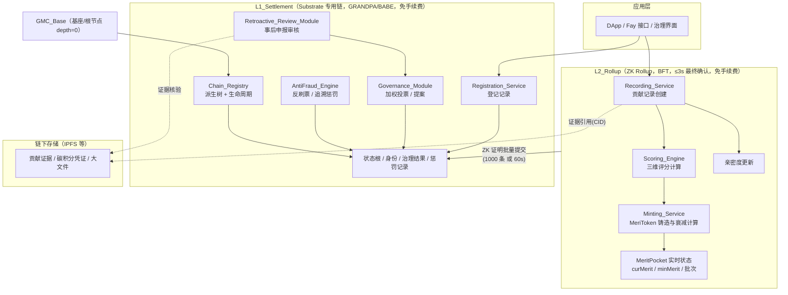

### 模块 → 分层映射

模块按"是否高频、是否需要数学确定性结算"划分到 L1 与 L2：

| 模块 | 主要职责 | 部署层 | 依据需求 |
|------|----------|--------|----------|
| `GMC_Base` | 顶层基座/根节点；拒绝货币兑换请求 | L1_Settlement | 1.1, 11.8 |
| `Chain_Registry` | 派生树维护、环路/深度/父链校验、生命周期、派生关系状态根 | L1_Settlement | 1.x, 2.x, 5.1 |
| `Governance_Module` | 加权投票、阈值判定、提案处理、变更锚定 | L1_Settlement | 2.1, 3.4/3.7/3.8, 7.7/7.9, 10.3/10.4, 11.5 |
| `Scoring_Engine` | 三维分类、膨胀指数、加权求和、配置校验 | L2_Rollup（结果与配置变更锚定 L1） | 6.x, 7.x, 8.3, 12.3 |
| `Registration_Service` | 受理登记申请、创建登记记录、授予触发条件守卫 | L1_Settlement（登记状态根锚定 L1） | 9.1, 9.2, 9.8 |
| `Recording_Service` | 贡献记录创建、登记匹配校验、Evaluation 认定衔接 | L2_Rollup（ZK 证明提交 L1） | 9.3/9.4/9.6/9.7, 12.1 |
| `Minting_Service` | 铸造 MeriToken、Merit 批次创建、配额计量、minMerit 更新、衰减计算 | L2_Rollup（状态根锚定 L1） | 4.x, 8.x, 10.6, 12.5/12.7 |
| `Retroactive_Review_Module` | 事后申报受理、证据可复盘校验、组织投票、状态锚定 | L1_Settlement（组织投票调用 Governance） | 10.x, 12.x |
| `AntiFraud_Engine` | 亲密度排除、随机抽样、异常审计、串通检测、追溯惩罚、ZK 投票隐私 | L1_Settlement（结果锚定 L1） | 11.x |

### 关键架构决策与理由

1. **`Chain_Registry`、`Registration_Service`、`Retroactive_Review_Module` 放在 L1**：这些是低频、强结算语义的操作（派生关系、登记状态、申报终局），需要 L1 的确定性最终性与状态根锚定。
2. **`Recording_Service`、`Scoring_Engine`、`Minting_Service` 放在 L2**：贡献记录与实时 MeriToken 计算是高频、低单价操作，必须免费且高吞吐，由 L2 批量处理后以 ZK 证明结算到 L1。
3. **`Governance_Module` 放在 L1**：投票结果属于治理终局状态，且事后申报、评判机制变更、膨胀指数变更都依赖其加权判定，需要 L1 的可审计性。
4. **证据采用链下存储 + 链上引用**：贡献证据和碳积分凭证可能很大，链上只保存可独立核验的引用（CID/哈希），保证可复盘性同时控制链上体积。

---

## Components and Interfaces

本节给出各模块的职责边界与核心接口签名（以语言无关的伪类型描述）。所有"金额/比例"类型使用定点小数（避免浮点误差）：`Decimal` 表示定点小数，`Ratio` 表示 [0,1] 区间的定点小数。

### GMC_Base

顶层基座，是派生树的根节点（depth = 0），同时是"禁止货币兑换"约束的统一拦截点。

```
interface GMC_Base {
  // 根节点常量
  rootChainId(): ChainId                 // 固定根标识，depth=0
  recordTopLevelCategory(cat): Result     // 顶层贡献行为类别（需求 1.1）

  // 货币兑换拦截（需求 11.8）
  rejectMonetaryRequest(req): Error        // 任何注资兑换/购买认定请求一律拒绝
}
```

### Chain_Registry

维护功勋链派生树与生命周期，是递归嵌套结构的核心。

```
interface Chain_Registry {
  derive(req: DeriveRequest): Result<ChainId, RegistryError>
  // 校验顺序：父链存在 → 不成环 → 深度≤16 → 领域(父链+领域)唯一
  // 任一校验失败：不写入任何记录，返回对应错误（需求 1.5/1.6/1.7, 2.5/2.9）

  getPath(chainId): Path                    // 从 GMC_Base 起的有序派生路径（需求 1.3）
  getChain(chainId): NestedMeritChain
  setLifecycle(chainId, state): Result      // active / suspended / archived
  resolveEvaluationMechanism(chainId): EvaluationMechanism
  // 若本链未定义，则沿父链上溯继承最近已定义配置（需求 3.2）
}
```

派生校验算法（伪代码）：

```
function derive(req):
    if req.parentId not in registry: return Error(ParentNotFound)      # 1.6
    parent = registry[req.parentId]
    if req.domain is empty or req.parentId is empty: return Error(MissingField)  # 2.5
    if (req.parentId, req.domain) in registry.index: return Error(DomainConflict) # 2.9
    newDepth = parent.depth + 1
    if newDepth > 16: return Error(DepthExceeded)                       # 1.7
    # 环路检测：新链尚不存在，故环路只能由"父链本身在新链的子树"造成；
    # 由于新链是叶子（无子节点），派生本身不会成环。
    # 环路风险来自"重新挂接(re-parent)"操作，统一走 detectCycle 守卫。
    if detectCycle(req.parentId, req.proposedId): return Error(CycleConflict)  # 1.5
    chain = createChain(req, depth=newDepth, path=parent.path + [newId])
    anchorToL1(chain)                                                   # 2.6
    return Ok(chain.id)
```

> 环路说明：纯"派生新叶子"在树结构中不可能成环。环路冲突校验（需求 1.5）针对的是任何会改变父指针的请求（如重新指定父链）；`detectCycle` 通过判断"目标父链是否等于自身或位于自身子树中"来拒绝。

### Governance_Module

执行加权投票、阈值判定与提案处理。

```
interface Governance_Module {
  openVote(subject: VoteSubject, threshold: Ratio, voters: VoterSet): VoteId
  castVote(voteId, voter, approve: bool): Result   // 经 ZK 保护身份
  tally(voteId): VoteOutcome
  // 加权：voter 权重 = voter.curMerit / Σ(voters.curMerit)（需求 11.5）
  // 通过条件：加权赞成比例 ≥ threshold
  anchorOutcome(voteId): Result                    // 锚定 L1（需求 3.8, 7.7, 10.7）
}
```

阈值来源：
- 常规贡献认定阈值：来自该链 `Evaluation_Mechanism.consensusThreshold`（需求 3.3，取值 (0,1]）。
- 事后申报阈值：`max(常规阈值, 2/3)` 且严格高于常规阈值（需求 10.3）。
- 评判机制/膨胀指数变更阈值：本链既定治理阈值（需求 3.4, 7.7）。

### Scoring_Engine

依据三维模型计算贡献评分与铸造数量。

```
interface Scoring_Engine {
  classify(contribution, mechanism): DimensionWeights
  // 返回 {Thought?: Ratio, Training?: Ratio, Technique?: Ratio}
  // 1~3 个维度，每个占比∈(0,1]，总和必须 = 1（需求 6.5/6.6/6.7）

  setInflationIndex(dim, value: Decimal): Result
  // 区间校验：Thought∈(1.00,10.00]；Training∈[0.95,1.05]；Technique∈[0.01,1.00]
  // 越界拒绝并保留原值（需求 7.1~7.4, 7.8）

  computeMintAmount(baseScores, weights): Decimal
  // amount = Σ_dim weights[dim] × baseScore[dim] × inflationIndex[dim]
  // 保证 amount > 0（需求 7.5/7.6, 8.3）
}
```

### Registration_Service

受理功勋登记并守卫授予触发条件。

```
interface Registration_Service {
  register(app: RegistrationApplication): Result<RegistrationId, RegError>
  // 必填：contributorId, chainId, description(≤2000 字), registeredAt
  // 校验失败不创建记录（需求 9.1/9.2）；初始 status = Valid
  findValidRegistration(contributorId, chainId): Option<Registration>
  canGrant(registration, record): bool
  // 当且仅当：存在有效登记 ∧ 存在关联贡献记录 ∧ 记录已通过认定（需求 9.8）
}
```

### Recording_Service

在已登记功勋之后记录具体贡献行为。

```
interface Recording_Service {
  record(req: ContributionRequest): Result<ContributionId, RecError>
  // 必须存在匹配的有效登记（contributorId+chainId+status=Valid）
  // 否则且未走事后申报 → Error(NotRegistered)（需求 9.4）
  markEvaluationResult(recordId, passed: bool): Result
  // passed=false：保留记录并标记"认定未通过"，不铸造（需求 9.6）
  submitRollupBatch(): ZkProof   // 批量记录的 ZK 证明提交 L1（需求 9.7）
}
```

### Minting_Service

铸造 MeriToken、管理配额、更新 minMerit、执行衰减计算。

```
interface Minting_Service {
  mint(req: MintRequest): Result<MeritBatch, MintError>
  // 流程：校验 amount>0 → 检查配额 → 创建批次 → 更新 minMerit → 累计配额消耗
  checkQuota(chainId, amount): bool        // 本周期累计 + amount ≤ Quota（需求 4.3）
  consumeQuota(chainId, amount): Result
  resetQuota(chainId): Result              // Refresh_Period 到期重置（需求 4.5）
  curMerit(pocketId, t): Decimal           // Σ 批次衰减值，保证 ≥ minMerit（需求 8.5）
  updateMinMerit(pocketId, mintedAmount): Decimal  // 底部值更新（需求 8.2）
}
```

### 关键流程序列图

#### 流程 1：功勋链派生（递归嵌套）

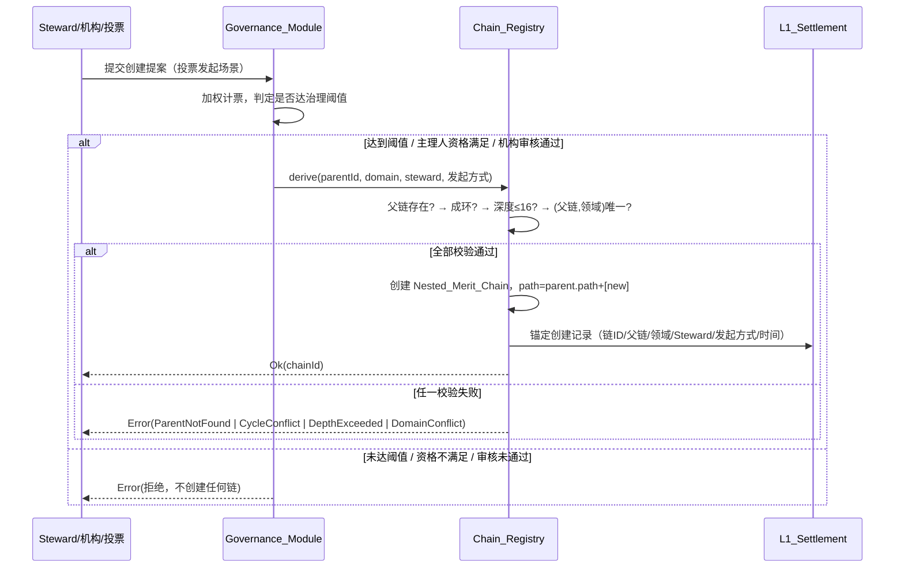

#### 流程 2：登记 → 记录 → 授予

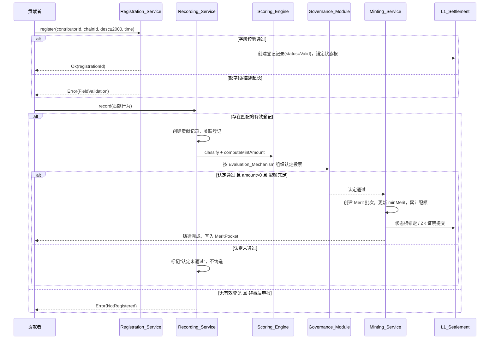

#### 流程 3：事后申报审核投票

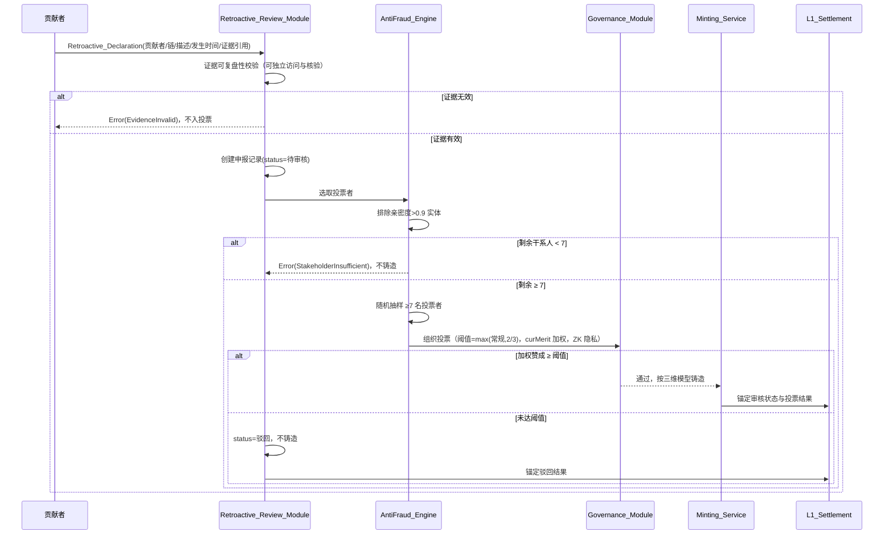

#### 流程 4：碳积分转 MeriToken

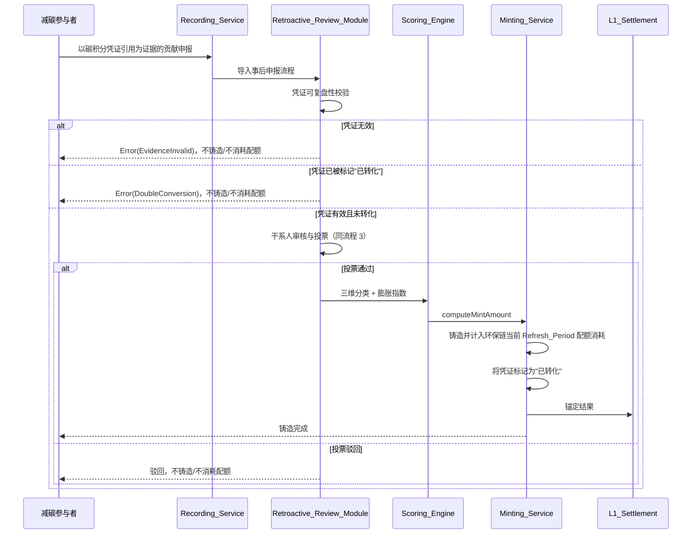

---

## Data Models

所有比例字段使用定点小数。所有时间字段为链上时间（block timestamp）。

### Chain_Registry 派生树

```
type ChainId = string

type NestedMeritChain {
  id: ChainId
  parentId: ChainId | null          // GMC_Base 为 null
  domain: string                    // 归属领域标识（需求 1.4, 2.5）
  path: ChainId[]                   // 从 GMC_Base 起的有序派生路径（需求 1.3）
  depth: int                        // GMC_Base=0；depth ≤ 16（需求 1.7）
  stewards: FayID[]                 // 至少一个 Steward（需求 2.4）
  originType: enum { VoteInitiated, StewardInitiated, InstitutionApplied }  // 发起方式（需求 2.1/2.2/2.3）
  createdAt: Timestamp              // 创建时间（需求 1.4）
  lifecycle: enum { Active, Suspended, Archived }
  evaluationMechanism: EvaluationMechanism | null   // null 表示继承（需求 3.2）
  config: NestedMeritChainConfig
}

// 唯一性索引：(parentId, domain) 唯一（需求 2.9）
index ChainDomainIndex: (parentId, domain) -> ChainId
```

派生树结构示意：

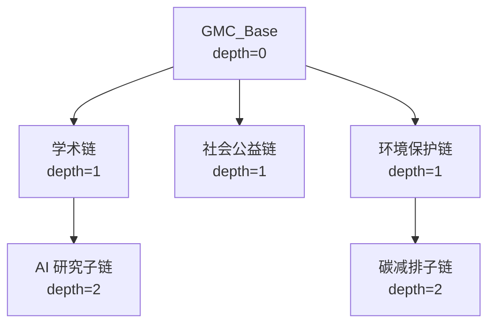

### Nested_Merit_Chain 配置

```
type EvaluationMechanism {
  acquisitionModes: set<enum { ObjectiveMetering, BountyTask }>  // 至少声明一种（需求 3.3）
  consensusThreshold: Ratio        // (0, 1]，大于 0 且不超过 1（需求 3.3/3.6）
  excludeHighIntimacy: bool = true // 沿用高亲密度排除（需求 3.5）
}

type NestedMeritChainConfig {
  quota: Decimal                   // > 0 的有限数值（需求 4.1/4.8）
  refreshPeriod: RefreshPeriod
  inflationIndex: {
    Thought: Decimal               // (1.00, 10.00]（需求 7.2）
    Training: Decimal              // [0.95, 1.05]（需求 7.3）
    Technique: Decimal             // [0.01, 1.00]（需求 7.4）
  }
}

type RefreshPeriod =
  | { kind: OneTime }                                  // 一次性，无刷新（需求 4.2）
  | { kind: Periodic, unit: enum{Second,Hour,Day}, value: Decimal }  // value > 0 有限（需求 4.1/4.8）

type QuotaLedger {
  chainId: ChainId
  mintedThisPeriod: Decimal        // 本周期累计已铸造（需求 4.4）
  periodStart: Timestamp
  exhausted: bool                  // 一次性链耗尽后置 true（需求 4.7）
}
```

### MeritPocket 与 Merit 批次

```
type MeritPocket {
  fayId: FayID                     // 绑定身份（沿用蓝图）
  minMerit: Decimal                // 底部值，初始 = e ≈ 2.718，只增不减（惩罚除外）（需求 8.2）
  batches: MeritBatch[]            // 活跃批次列表
}

type MeritBatch {
  batchId: string
  V: Decimal                       // 初始 Merit 值（= 单次铸造数量，>0）（需求 8.1/8.3）
  B: Decimal                       // 该批次对底部值的贡献
  lambda: Decimal                  // 衰减系数 = k / 影响期限
  influenceDuration: Decimal       // 影响期限（> 0）（需求 8.1）
  acquiredAt: Timestamp            // 获取时间（链上时间）（需求 8.1）
  sourceChainId: ChainId
}

// 单批次衰减（沿用蓝图 4.4）：
//   MeriToken_i(t) = (V_i - B_i) × e^(-λ_i × t) + B_i
// curMerit(t) = Σ_i MeriToken_i(t)；不变式 curMerit ≥ minMerit（需求 8.5）

// 底部值更新（沿用蓝图 4.5，需求 8.2）：
//   设当前 curMerit=M，新铸造 x，当前 minMerit=B
//   B' = (x + M) × B / M
```

### 登记记录

```
type Registration {
  id: string
  contributorId: FayID
  chainId: ChainId
  description: string              // ≤ 2000 字（需求 9.1/9.2）
  registeredAt: Timestamp
  status: enum { Valid, Consumed, Revoked }  // 初始 Valid（需求 9.1）
}
```

### 贡献记录

```
type ContributionRecord {
  id: string
  registrationId: string | null    // 关联的有效登记（事后申报可为 null）
  contributorId: FayID
  chainId: ChainId
  evidenceRefs: EvidenceRef[]       // 链下证据引用（CID/哈希）
  dimensionWeights: DimensionWeights  // 三维占比，总和=1（需求 6.5）
  baseScores: { Thought?, Training?, Technique?: Decimal }
  evaluationStatus: enum { Pending, Passed, Failed }  // Failed=认定未通过（需求 9.6）
  recordedAt: Timestamp
}

type DimensionWeights = map<enum{Thought,Training,Technique}, Ratio>  // size 1~3，值∈(0,1]，和=1
```

### 事后申报记录

```
type RetroactiveDeclaration {
  id: string
  contributorId: FayID
  chainId: ChainId
  description: string
  occurredAt: Timestamp             // 贡献发生时间（需求 10.1）
  evidenceRefs: EvidenceRef[]       // 至少一条可复盘证据引用（需求 10.2）
  reviewStatus: enum { Pending, Approved, Rejected }  // 初始 Pending（需求 10.1/10.5）
  voteId: VoteId | null
}

type EvidenceRef {
  uri: string                       // 链上记录引用 或 外部可验证记录（CID/URL+哈希）
  hash: string                      // 用于可复盘性校验
  replayable: bool                  // 审核者可独立访问与核验（需求 10.2/10.8）
}
```

### 碳积分凭证状态

```
type CarbonCreditVoucher {
  voucherId: string                 // 凭证唯一标识
  evidenceRef: EvidenceRef          // 可验证碳积分凭证引用（需求 12.1）
  converted: bool                   // 是否已转化为 MeriToken（需求 12.6/12.7）
  convertedDeclarationId: string | null  // 转化对应的申报记录
}

// 不变式：每个 voucherId 至多被转化一次（converted 一旦为 true 不再可转化）
```

### 数据流与存储分层

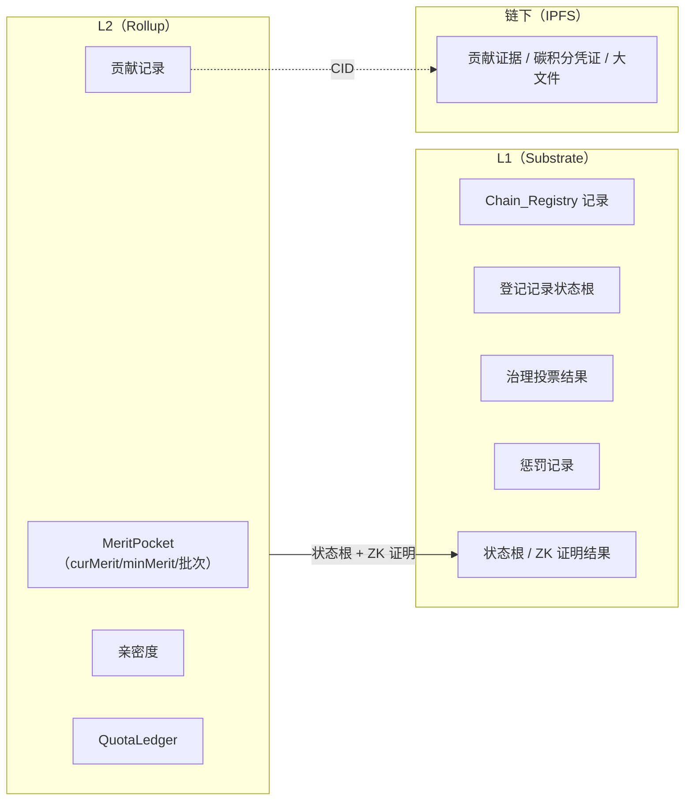

---

## 三维评分计算流程（Scoring Computation Flow）

本节细化 `Scoring_Engine` 的计算流程（需求 6、7、8、12.3）。

### 计算步骤

1. **维度分类（需求 6.1–6.4）**：依据贡献所属链的 `Evaluation_Mechanism`，将贡献归入 Thought / Training / Technique 中的 1~3 个维度。
   - 引领认知突破（科研、发明）→ Thought
   - 快速普及既有事物、提升效率（训练专用 AI）→ Training
   - 以技能/手艺提供价值（服务、表演、手工艺）→ Technique
2. **占比校验（需求 6.5/6.7）**：每个适用维度占比 `w_dim ∈ (0, 1]`，且 `Σ w_dim = 1`（即 100%）。不满足 → 拒绝并返回占比校验错误。
3. **维度未匹配处理（需求 6.6）**：无法归入任一维度 → 拒绝评分、不铸造、返回维度未匹配错误。
4. **膨胀指数应用（需求 7.5/7.6）**：取该链配置的各维度 `Inflation_Index`，区间为 Thought (1.00,10.00]、Training [0.95,1.05]、Technique [0.01,1.00]。
5. **加权求和（需求 7.6）**：

```
mintAmount = Σ_{dim ∈ 适用维度} w_dim × baseScore_dim × inflationIndex_dim
```

6. **正数保证（需求 7.5/8.3）**：由于每个适用维度 `w_dim > 0`、`inflationIndex_dim ≥ 0.01 > 0`，只要至少一个 `baseScore_dim > 0`，则 `mintAmount > 0`。`Scoring_Engine` 在 `baseScore` 全为 0 或结果不大于 0 时返回错误，`Minting_Service` 拒绝铸造（需求 8.7）。

### 计算示例

某跨维度贡献（科研 + 工程实现）：
- Thought 占比 0.7，baseScore 10，indexThought 3.00 → 0.7×10×3.00 = 21.0
- Technique 占比 0.3，baseScore 10，indexTechnique 0.80 → 0.3×10×0.80 = 2.4
- mintAmount = 23.4（> 0，进入铸造）

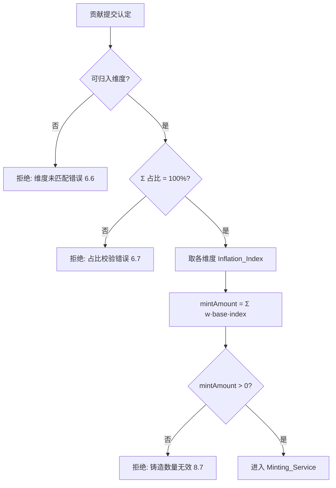

---

## 登记/记录/授予与事后申报生命周期

### 标准流程状态机

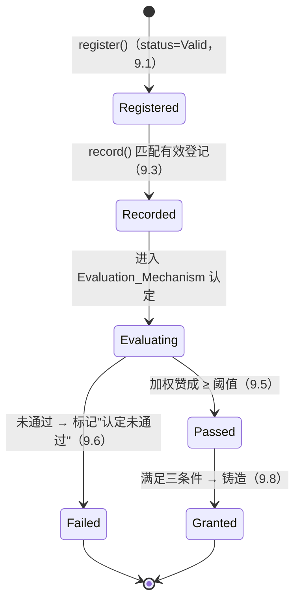

授予守卫（需求 9.8）：当且仅当同时满足"存在匹配的有效登记 ∧ 存在关联贡献记录 ∧ 该记录已通过认定"时触发铸造。

### 事后申报流程要点

- 证据校验前置（需求 10.2/10.8）：至少一条可复盘证据引用，且必须可被审核者独立访问与核验，否则不入投票。
- 阈值更严（需求 10.3）：`retroThreshold = max(链常规阈值, 2/3)` 且严格高于常规阈值。
- 反作弊全程介入（需求 10.4 + 11.x）：亲密度排除、随机抽样、curMerit 加权、ZK 投票隐私。

---

## 配额与刷新周期核算（Quota Accounting）

设计要点（需求 4）：

- **逐链隔离（需求 4.6）**：每个 `Nested_Merit_Chain` 维护独立 `QuotaLedger`，配额消耗互不影响。
- **进行中累计（需求 4.4）**：每次成功铸造累加 `mintedThisPeriod`。
- **超限拒绝（需求 4.3/4.7）**：若 `mintedThisPeriod + amount > quota` 则拒绝铸造、返回配额超限错误，且被拒请求不计入累计（计数不变）。
- **一次性（需求 4.2/4.7）**：`OneTime` 链 `quota` 耗尽后置 `exhausted=true`，后续请求一律拒绝，不恢复配额。
- **周期重置（需求 4.5）**：`Periodic` 链在 `Refresh_Period` 到期时将 `mintedThisPeriod` 重置为 0，刷新 `periodStart`。
- **配置校验（需求 4.8）**：`quota` 必须为 > 0 的有限数值；`refreshPeriod` 必须为 `OneTime` 或带显式单位且 value > 0 的有限间隔，否则拒绝配置。

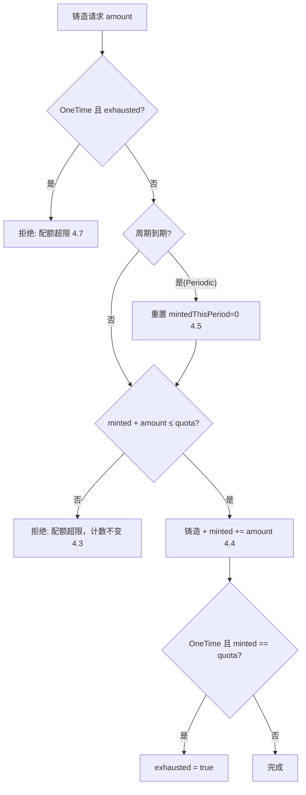

---

## 与 MeriToken 衰减/底部值模型集成

设计要点（需求 8，沿用蓝图第 04 章）：

1. **批次创建（需求 8.1）**：每次铸造创建独立 `MeritBatch`，记录 `V`（= 单次铸造数量，>0）、`influenceDuration`（>0）、`lambda`、`acquiredAt`（链上时间）。
2. **minMerit 更新（需求 8.2）**：按蓝图公式 `B' = (x + M) × B / M`。由于 `x > 0` 且 `M ≥ B`，有 `B' = B × (1 + x/M) ≥ B`，即 minMerit 只增不减（惩罚除外）。
3. **单批次独立衰减（需求 8.4）**：`MeriToken_i(t) = (V_i - B_i)·e^(-λ_i·t) + B_i`。
4. **curMerit ≥ minMerit 不变式（需求 8.5）**：每个批次衰减下限为其 `B_i`，全部批次衰减后 `curMerit → Σ B_i`；底部值更新规则保证 `minMerit ≤ Σ B_i`，故任意时刻 `curMerit ≥ minMerit`。
5. **L2 实时计算 + L1 锚定（需求 8.6）**：MeriToken 计算在 L2 执行，状态根锚定 L1。
6. **无效铸造拒绝（需求 8.7）**：`amount ≤ 0` 时不创建批次、不修改 curMerit/minMerit、返回错误。

---

## L1/L2 分层架构集成

设计要点（需求 13）：

| 关注点 | 设计 |
|--------|------|
| L1 存储（13.1） | 功勋链注册记录、身份注册记录、治理投票结果、惩罚记录、状态根 |
| L2 处理与时延（13.2） | 贡献记录创建、MeriToken 计算、亲密度更新；记录提交后 5 秒内返回计算结果 |
| 批量证明（13.3） | 累计 1,000 条 **或** 距上批满 60 秒（先到者为准）即提交 ZK 证明 |
| 免手续费（13.4） | L1 对每条交易不收费 |
| 分片扩展（13.5） | 提交速率持续 > 单实例额定吞吐（默认 1,000 条/秒）超 60 秒 → 新增并行 Rollup 实例，直至总额定吞吐 ≥ 提交速率 |
| L1 共识（13.6） | GRANDPA/BABE |
| L2 共识（13.7） | BFT 类共识，区块最终确认 ≤ 3 秒 |
| 证明失败处理（13.8） | L1 验证失败 → 拒绝该批次状态更新、保留上一已确认状态根、返回证明验证失败错误 |

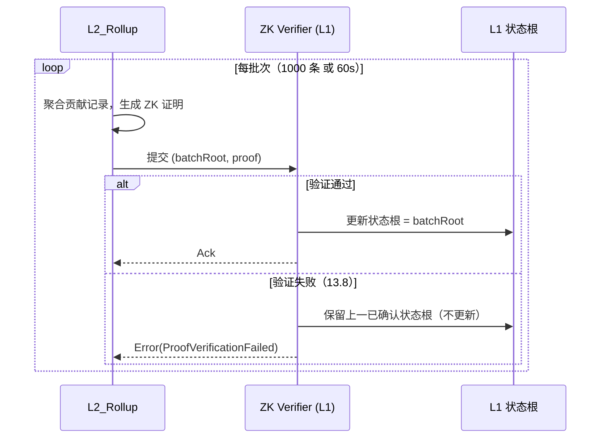

分片扩展决策：

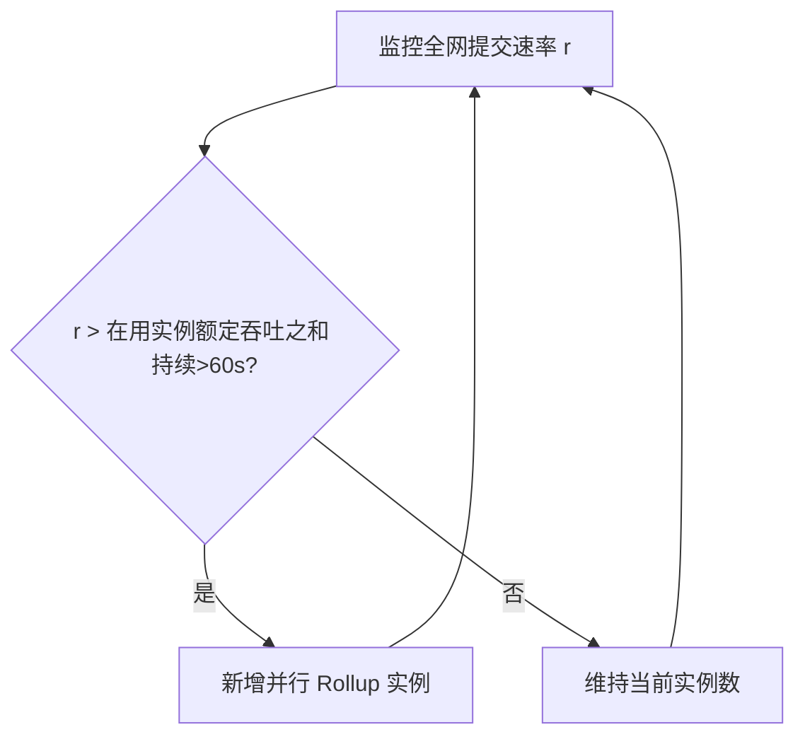

---

## 技术选型评估（递归嵌套关系实现）

本节满足需求 5：在基准候选 **Substrate L1 + ZK Rollup L2** 与对照候选 **以太坊及同类产品的派生/子链方案** 之间，从三个维度做出有据可依的对比与建议。评估范围限定为"递归嵌套功勋链的派生与贡献记录"。

### 候选方案

- **基准候选（Baseline）**：Substrate 专用链（L1）+ ZK Rollup（L2）。嵌套功勋链以 Runtime 模块/状态树表达派生关系，贡献记录在 L2 处理（需求 5.2/5.4）。
- **对照候选 A**：以太坊主网 + 智能合约（每个功勋链=合约/子合约，派生=合约工厂）。
- **对照候选 B**：以太坊 L2（Rollup 生态，如通用 ZK/Optimistic Rollup）+ 合约化派生。
- **对照候选 C**：以太坊"子链/应用链"方案（如 L3 / 应用专用 Rollup）。

### 三维对比（需求 5.3）

| 维度 | 基准：Substrate L1 + ZK Rollup L2 | 对照 A：Ethereum 主网 | 对照 B：Ethereum L2 | 对照 C：Ethereum 子链/L3 |
|------|-----------------------------------|----------------------|---------------------|--------------------------|
| 单条贡献记录交易成本 | 可设计为免手续费（L1 不收费，L2 链下处理）→ 满足"免费或极低成本记录"约束（需求 5.5） | 高 Gas，每条记录向贡献者收费 → **不满足**约束（需求 5.5） | 低于主网但通常仍有费用，存在向贡献者收费风险 → 需逐案判定是否满足约束 | 进一步降低，但生态/桥接复杂度高，成本可控性弱于自建 |
| 吞吐量（单位时间记录数） | L2 高吞吐 + 分片可水平扩展（默认 1000 条/秒/实例，可扩展）（需求 13.5） | 主网约 15–30 TPS，远不足全民高频记录 | 受底层 Ethereum 数据可用性与结算约束 | 较高，但跨层最终性与互操作开销大 |
| 可定制治理（自定义评判机制/独立配额/刷新周期） | Runtime 模块完全可定制，天然支持每链独立 `Evaluation_Mechanism`/`Quota`/`Refresh_Period` 与定制共识 | 合约可表达但受 EVM 与 Gas 模型约束，定制共识/免费交易困难 | 受 Rollup 框架与 Ethereum 治理约束 | 可定制性较 A/B 高，但仍受 Ethereum 安全/数据层约束 |

### 约束判定（需求 5.5）

- 任何"对每条贡献记录向贡献者收取手续费"或"单条记录成本超过协议规定上限"的方案，标记为**不满足"免费或极低成本记录"约束**。据此：对照 A 明确不满足；对照 B/C 存在收费风险，需按实际部署参数逐案判定。

### 选型建议（需求 5.6）

三维对比完成后输出建议：**采用基准候选 Substrate L1 + ZK Rollup L2**。三维依据：
1. **交易成本**：基准可实现免手续费记录，唯一无条件满足需求 5.5 约束的方案；对照 A 直接违反。
2. **吞吐量**：基准 L2 + 分片可水平扩展到全民规模，满足需求 13.5；以太坊主网吞吐远不足。
3. **可定制治理**：基准的 Runtime 模块可原生表达递归派生、每链独立配额/刷新周期与自定义评判机制，契合原则一与需求 3/4。

对照候选 B/C 作为未来互操作/生态接入的备选保留，但不作为递归嵌套核心实现的首选。

---

## Correctness Properties

> 属性（property）是系统在所有合法执行下都应保持为真的特征或行为——本质上是关于"系统应该做什么"的形式化陈述。属性是人类可读规约与机器可验证正确性保证之间的桥梁。

本节将可测试的验收标准转化为通用量化（"对任意…"）的属性，作为后续属性测试（property-based testing）的规约。本协议含大量纯逻辑（派生树不变式、评分数学、配额核算、衰减模型、投票者选取），适用 PBT。基础设施类（L1 锚定、ZK 隐私、共识时延、分片扩容）、配置类（共识算法、免手续费）与文档交付物类（技术选型评估）的验收标准不在本节，改由集成测试/冒烟测试/示例测试覆盖（见测试策略）。

经属性反思（消除冗余）后，保留以下 30 条属性，每条提供独立验证价值。

### Property 1: 派生路径与元数据完整性

*对任意* 由合法派生请求序列构造出的功勋链注册表，每个非根 `Nested_Merit_Chain` 都满足：其 `parentId` 指向注册表中已存在的链；其 `path` 以 `GMC_Base` 开头、末位为该链自身、相邻元素构成父子关系，且 `len(path) == depth + 1`；并记录了非空的领域标识、父链标识与创建时间。

**Validates: Requirements 1.2, 1.3, 1.4**

### Property 2: 派生树永不成环

*对任意* 包含派生与重挂接（re-parent）操作的请求序列，功勋链注册表在任意时刻都不存在环路（不存在某链成为自身祖先）；任何会形成环路的请求都被拒绝，且被拒后注册表状态保持不变。

**Validates: Requirements 1.5**

### Property 3: 层级深度上界

*对任意* 派生请求序列，注册表中每条链的 `depth` 都不超过 16（以 `GMC_Base` 为 depth=0）；任何会使深度超过 16 的派生请求都被拒绝，且被拒后注册表状态保持不变。

**Validates: Requirements 1.7**

### Property 4: (父链, 领域) 全局唯一

*对任意* 创建请求序列，注册表中任意两条不同的链不会具有相同的 `(parentId, domain)` 组合；任何与既有组合重复的创建请求都被拒绝，且既有链记录保持不变。

**Validates: Requirements 2.9**

### Property 5: 每条链至少一个 Steward

*对任意* 成功创建的 `Nested_Merit_Chain`，其 `stewards` 集合至少包含一个 Steward 标识。

**Validates: Requirements 2.4**

### Property 6: 评判机制沿派生路径继承

*对任意* 功勋链派生树及任意"已定义/未定义自定义评判机制"的节点分布，对某条未定义自定义机制的链解析 `Evaluation_Mechanism`，所得配置等于其 `path` 上溯方向第一个已定义自定义机制的祖先链配置。

**Validates: Requirements 3.2**

### Property 7: 评判机制配置校验

*对任意* 评判机制配置，当且仅当它至少声明一种贡献认定获取方式且其共识通过阈值落在区间 (0, 1] 内时被接受；否则配置被拒绝，且先前有效配置保持不变。

**Validates: Requirements 3.3, 3.6**

### Property 8: 未达治理阈值则配置不变

*对任意* 评判机制变更提案及任意投票分布，当其加权赞成比例未达到本链既定治理阈值时，变更被拒绝且现有配置保持不变。

**Validates: Requirements 3.7**

### Property 9: 配额永不超限（含一次性耗尽不恢复）

*对任意* 针对单条链的铸造请求序列，本周期已铸造累计量 `mintedThisPeriod` 在任意时刻都不超过该链 `Quota`；任何会使累计超过 `Quota` 的铸造请求都被拒绝且不计入累计（计数不变）；被配置为一次性的链在 `Quota` 耗尽后对后续所有请求恒拒绝，且不恢复任何可用配额。

**Validates: Requirements 4.2, 4.3, 4.4, 4.7**

### Property 10: 刷新周期到期重置

*对任意* 非一次性链及任意随时间推进的铸造序列，每当跨越一个 `Refresh_Period` 边界，`mintedThisPeriod` 在新周期起点被重置为 0。

**Validates: Requirements 4.5**

### Property 11: 配额逐链隔离

*对任意* 涉及多条链的交错铸造请求序列，任一条链的 `mintedThisPeriod` 仅由对该链的铸造决定，对其它链的铸造不改变本链的可用配额。

**Validates: Requirements 4.6**

### Property 12: 配额与刷新周期配置校验

*对任意* 链配置，当且仅当 `Quota` 为大于零的有限数值，且 `Refresh_Period` 为"一次性"或带显式时间单位（秒/小时/天）且取值大于零的有限间隔时被接受；否则配置被拒绝。

**Validates: Requirements 4.1, 4.8**

### Property 13: 维度占比和为 100%

*对任意* 被成功归类的贡献，`Scoring_Engine` 输出的维度集合规模在 1 至 3 之间，每个适用维度占比落在 (0, 1] 内，且所有适用维度占比之和恰好等于 1（即 100%）。

**Validates: Requirements 6.1, 6.5**

### Property 14: 膨胀指数区间校验

*对任意* 膨胀指数配置，当且仅当 Thought 维度取值落在 (1.00, 10.00]、Training 维度落在 [0.95, 1.05]、Technique 维度落在 [0.01, 1.00]（均精确到两位小数）时被接受；任一维度越界则该配置被拒绝，且该维度原有指数保持不变。

**Validates: Requirements 7.1, 7.2, 7.3, 7.4, 7.8**

### Property 15: 铸造数量按维度加权求和且为正

*对任意* 含 1 至 3 个适用维度的合法贡献（各维度基础分非负且至少一维大于零、占比之和为 1、各维度指数落在规定区间），`Scoring_Engine` 计算的单次铸造数量等于 `Σ_dim (占比_dim × 基础分_dim × 膨胀指数_dim)`，且该结果严格大于零。

**Validates: Requirements 7.5, 7.6, 8.3**

### Property 16: minMerit 单调非减

*对任意* MeritPocket 及任意成功铸造请求序列（非惩罚场景），每次铸造后的 `minMerit` 都大于或等于铸造前的 `minMerit`（由 `B' = (x+M)×B/M`，在 `x>0` 且 `M≥B` 下恒有 `B'≥B`）。

**Validates: Requirements 8.2**

### Property 17: curMerit 永不低于 minMerit（含批次独立衰减）

*对任意* MeritPocket、任意铸造批次组合及任意时间点 `t`，每个批次按 `MeriToken_i(t) = (V_i - B_i)·e^(-λ_i·t) + B_i` 独立衰减（对 `t` 非增、下限为 `B_i`），且 `curMerit(t) = Σ_i MeriToken_i(t)` 恒大于或等于 `minMerit`。

**Validates: Requirements 8.1, 8.4, 8.5**

### Property 18: 登记申请字段校验

*对任意* 功勋登记申请，当且仅当其包含贡献者标识、所属功勋链标识、登记时间且预期贡献描述长度不超过 2000 字时被接受并创建初始状态为"有效"的登记记录；否则申请被拒绝且不创建任何登记记录。

**Validates: Requirements 9.1, 9.2**

### Property 19: 贡献记录须匹配有效登记

*对任意* 登记表与贡献记录请求，未走事后申报流程时，贡献记录被创建当且仅当存在一条与之匹配（贡献者标识一致、功勋链标识一致、登记状态为"有效"）的登记记录；否则被拒绝并返回"未登记"错误。

**Validates: Requirements 9.3, 9.4**

### Property 20: 授予三条件守卫

*对任意* (是否存在匹配有效登记、是否存在关联贡献记录、该记录是否已通过认定) 三个条件的布尔组合，铸造（授予）动作被触发当且仅当三个条件同时为真；任一条件为假时不铸造任何 MeriToken。

**Validates: Requirements 9.5, 9.6, 9.8**

### Property 21: 事后申报受理证据校验

*对任意* 事后申报，当且仅当其包含贡献者标识、所属功勋链标识、已发生贡献描述、贡献发生时间，且至少附带一条可被审核者独立访问与核验（可复盘）的证据引用时被受理并标记为"待审核"；否则被拒绝且不推入投票流程。

**Validates: Requirements 10.1, 10.2, 10.8**

### Property 22: 事后申报阈值严格更高

*对任意* 链的常规贡献认定通过阈值 `regular ∈ (0, 1)`，对应的事后申报通过阈值满足 `retro == max(regular, 2/3)`，且 `retro` 严格大于 `regular`，同时 `retro` 不低于参与投票总加权票数的三分之二。

**Validates: Requirements 10.3**

### Property 23: 事后申报未达阈值则驳回

*对任意* 事后申报投票及任意投票分布，当最终加权赞成票数低于事后申报通过阈值时，该申报被标记为"驳回"且不触发任何 MeriToken 铸造。

**Validates: Requirements 10.5**

### Property 24: 投票者选取排除高亲密度且规模合规

*对任意* 贡献者及其干系人集合（各带归一化亲密度 ∈ [0,1]），当排除亲密度大于 0.9 的全部实体后剩余干系人不少于 7 名时，所选投票者集合中每个成员与贡献者的亲密度都不超过 0.9，且集合规模不少于 7 名且不超过剩余干系人总数。

**Validates: Requirements 11.1, 11.2**

### Property 25: 异常投票行为检测

*对任意* 投票者在最近 30 天评估窗口内对同一对象的投票历史，当且仅当其赞成投票次数不少于 5 次且赞成票占其对该对象全部投票的比例超过 80% 时，该投票行为被标记为异常并记入待审计条目。

**Validates: Requirements 11.4**

### Property 26: 投票按 curMerit 占比加权

*对任意* 投票者集合及其 curMerit 取值，每个投票者的投票权重等于其 `curMerit` 占该集合 `curMerit` 总和的比例，且所有投票者权重之和等于 1。

**Validates: Requirements 11.5**

### Property 27: 碳积分凭证至多转化一次

*对任意* 碳积分凭证及针对该凭证的任意申报请求序列，至多有一次申报成功铸造 MeriToken；一旦凭证被标记为"已转化"，其后所有针对该凭证的申报都被拒绝（返回重复转化错误），不铸造且不消耗任何配额。

**Validates: Requirements 12.6, 12.7**

### Property 28: 碳积分铸造计入当前周期配额

*对任意* 环境保护链上经审核通过的碳积分申报铸造，铸造数量被计入该链当前 `Refresh_Period` 的配额消耗，且计入后本周期累计量仍不超过 `Quota`。

**Validates: Requirements 12.5**

### Property 29: 批量证明触发条件

*对任意* 贡献记录到达序列与时间推进，L2_Rollup 向 L1_Settlement 提交批量零知识证明当且仅当自上一批次以来累计记录达到 1,000 条或距上一批次提交已满 60 秒（以先到者为准）。

**Validates: Requirements 13.3**

### Property 30: 证明验证失败保留前一状态根

*对任意* 提交到 L1 的批次证明序列（含有效与无效证明），L1 的已确认状态根仅在证明验证通过时更新为该批次状态根；任何验证失败的批次都被拒绝更新，状态根保留为上一已确认值。

**Validates: Requirements 13.8**

---

## Error Handling

错误处理遵循统一原则：**校验前置、失败原子、状态不变、错误可辨识**。任何被拒绝的请求都不得产生部分写入（无副作用），且返回可机器辨识的错误码。

### 错误分类与处理策略

| 错误类别 | 触发条件 | 错误码 | 处理策略 | 依据需求 |
|----------|----------|--------|----------|----------|
| 派生校验 | 父链不存在 | `ParentNotFound` | 拒绝，注册表不变 | 1.6 |
| 派生校验 | 形成环路 | `CycleConflict` | 拒绝，注册表不变 | 1.5 |
| 派生校验 | 深度 > 16 | `DepthExceeded` | 拒绝，注册表不变 | 1.7 |
| 创建校验 | 缺父链/领域标识 | `MissingField`（指明字段） | 拒绝，不创建 | 2.5 |
| 创建校验 | (父链,领域) 重复 | `DomainConflict` | 拒绝，保留既有链 | 2.9 |
| 创建校验 | 主理人资格不满足 | `StewardNotQualified` | 拒绝，不创建 | 2.7 |
| 创建校验 | 机构申请未过审 | `InstitutionReviewFailed` | 拒绝，不创建 | 2.8 |
| 机制校验 | 机制配置非法 | `MechanismConfigInvalid` | 拒绝，保留旧配置 | 3.6 |
| 治理 | 变更未达阈值 | `GovernanceThresholdNotMet` | 拒绝，保留现状 | 3.7, 7.9 |
| 配额 | 本周期超额 / 一次性耗尽 | `QuotaExceeded` | 拒绝，计数不变，一次性不恢复 | 4.3, 4.7 |
| 配额校验 | quota 非正或周期非法 | `QuotaConfigInvalid` | 拒绝配置 | 4.8 |
| 评分 | 无法归入任一维度 | `DimensionUnmatched` | 拒绝评分，不铸造 | 6.6 |
| 评分 | 占比和 ≠ 100% | `WeightSumInvalid` | 拒绝评分，不铸造 | 6.7 |
| 评分 | 膨胀指数越界 | `InflationIndexOutOfRange` | 拒绝配置，保留原值 | 7.8 |
| 铸造 | 数量 ≤ 0 | `InvalidMintAmount` | 拒绝，不创建批次，curMerit/minMerit 不变 | 8.7 |
| 登记 | 缺字段 / 描述超 2000 字 | `FieldValidation` | 拒绝，不创建登记 | 9.2 |
| 记录 | 无匹配有效登记且非事后申报 | `NotRegistered` | 拒绝记录 | 9.4 |
| 事后申报 | 证据不可复盘 | `EvidenceInvalid` | 拒绝，不入投票 | 10.8, 12.4 |
| 事后申报 | 未达阈值 | `RetroThresholdNotMet` | 标记驳回，不铸造 | 10.5 |
| 反作弊 | 剩余干系人 < 7 | `StakeholderInsufficient` | 暂缓投票，不铸造 | 11.3 |
| 反作弊 | 货币兑换/购买认定 | `OperationNotAllowed` | 拒绝，不铸造，不改认定 | 11.8 |
| 碳积分 | 凭证已转化 | `DoubleConversion` | 拒绝，不铸造，不消耗配额 | 12.6 |
| 分层 | ZK 证明验证失败 | `ProofVerificationFailed` | 拒绝批次更新，保留上一状态根 | 13.8 |

### 原子性与回滚

- **L1 操作**：派生、创建、登记、治理结果写入采用单笔交易语义，校验失败即整体回滚。
- **L2 铸造**：铸造遵循"校验金额 > 0 → 检查配额 → 创建批次 → 更新 minMerit → 累计配额"顺序，任一前置校验失败则不进入后续步骤，保证 `MeritPocket` 与 `QuotaLedger` 不被部分修改。
- **事后追溯惩罚（需求 11.6）**：检测到串通刷票后，回收因该次认定铸造的 MeriToken（铸造的逆操作）、撤销认定结果，并将处理结果锚定 L1；回收须保证 MeritPocket 状态可一致回退。

### 跨层失败处理

- **证明验证失败（需求 13.8）**：L1 拒绝该批次状态更新并保留上一已确认状态根，向 L2 返回 `ProofVerificationFailed`，L2 据此重放或重新打包该批次。
- **L2 时延超限（需求 13.2）**：若 5 秒内无法返回计算结果，视为该批次处理异常，进入重试/重新打包路径，不影响 L1 既有状态根。

---

## Testing Strategy

采用**双轨测试**：属性测试覆盖通用不变式，单元/示例测试覆盖具体行为与错误条件，集成测试覆盖跨层与外部服务，冒烟测试覆盖一次性配置。

### 属性测试（Property-Based Testing）

- **库选择**：协议核心若以 Rust（Substrate 生态）实现，采用 `proptest`；若核心逻辑/参考模型以 TypeScript 实现，采用 `fast-check`。**不自行实现属性测试框架**。
- **迭代次数**：每条属性测试至少运行 100 次随机迭代。
- **标签格式**：每条属性测试以注释标注其对应设计属性，格式为：
  `Feature: gmc-core-protocol, Property {编号}: {属性文本}`
- **覆盖映射**：本文档"正确性属性"中的 Property 1–30 各由**单一**属性测试实现。
- **生成器要点**：
  - 派生树生成器：随机生成合法派生序列与含重挂接的操作序列，覆盖父链不存在（1.6）、深度边界（1.7）、领域重复（2.9）等边角。
  - 评分生成器：随机生成 1~3 维占比（含和≠1 的非法样本，覆盖 6.7）、各维膨胀指数（含越界样本，覆盖 7.8）、基础分。
  - 铸造/衰减生成器：随机生成铸造金额（含 ≤0，覆盖 8.7）、影响期限、时间点序列，验证 minMerit 单调（16）与 curMerit≥minMerit（17）。
  - 配额生成器：随机多链交错铸造与时间推进，覆盖超限（4.3）、重置（4.5）、隔离（4.6）、一次性耗尽（4.7）。
  - 投票者生成器：随机干系人池与亲密度分布，覆盖排除阈值 0.9（11.1）、抽样规模 ≥7（11.2/11.3）、curMerit 加权（11.5）。
  - 碳积分生成器：随机重复申报同一凭证序列，覆盖至多一次转化（12.6/12.7）。

### 单元 / 示例测试

聚焦具体行为、分类示例与错误条件（不宜用属性穷举的部分）：

- 发起通道示例：投票发起（2.1）、主理人发起（2.2）、机构申请（2.3）及其拒绝路径（2.7/2.8）。
- 维度分类示例：科研→Thought（6.2）、AI 训练→Training（6.3）、手艺→Technique（6.4）。
- 治理阈值生效示例：机制变更（3.4）、膨胀指数变更（7.9）。
- 错误条件示例：缺字段（2.5）、维度未匹配（6.6）、未登记（9.4）、证据无效（10.8/12.4）、干系人不足（11.3）、货币兑换拒绝（11.8）。
- 串通追溯回收示例（11.6）：构造串通场景，验证回收铸造、撤销认定、锚定结果。
- 选型判定示例（5.5）：收费方案→标记不满足；免费方案→满足。

### 集成测试（1–3 个代表性样例）

覆盖外部服务与跨层行为（不适用 PBT）：

- L1 存储职责（13.1）、L1 锚定（2.6, 3.8, 7.7, 8.6, 10.7, 5.1）。
- L2 处理与时延（9.7, 13.2）、ZK 证明提交与验证失败（与属性 30 互补的端到端样例）。
- 分片扩容触发（13.5）、L2 BFT 最终确认 ≤3s（13.7）。
- ZK 投票隐私（11.7）：验证投票输出仅含结果、不泄露身份。

### 冒烟测试（单次执行）

覆盖一次性配置与文档交付物：

- 根节点配置（1.1）、L1 免手续费（13.4）、L1 共识 GRANDPA/BABE（13.6）。
- 技术选型评估交付物存在性（5.2, 5.3, 5.6）：检查设计文档"技术选型评估"含基准候选、对照候选、三维对比表与附依据的建议。

### 测试与需求追溯矩阵（摘选）

| 测试类型 | 覆盖需求 |
|----------|----------|
| 属性测试 Property 1–30 | 1.2–1.7, 2.4, 2.9, 3.2/3.3/3.6/3.7, 4.1–4.8, 6.1/6.5, 7.1–7.6/7.8, 8.1–8.5, 9.1–9.6/9.8, 10.1/10.2/10.3/10.5/10.8, 11.1/11.2/11.4/11.5, 12.5/12.6/12.7, 13.3/13.8 |
| 示例/单元测试 | 2.1/2.2/2.3/2.5/2.7/2.8, 3.4, 5.5, 6.2/6.3/6.4/6.6/6.7, 7.9, 8.7, 9.4, 10.6/10.8, 11.3/11.6/11.8, 12.1/12.2/12.4 |
| 集成测试 | 2.6, 3.8, 5.1/5.4, 7.7, 8.6, 9.7, 10.7, 11.7, 13.1/13.2/13.5/13.7 |
| 冒烟测试 | 1.1, 5.2/5.3/5.6, 13.4/13.6 |
